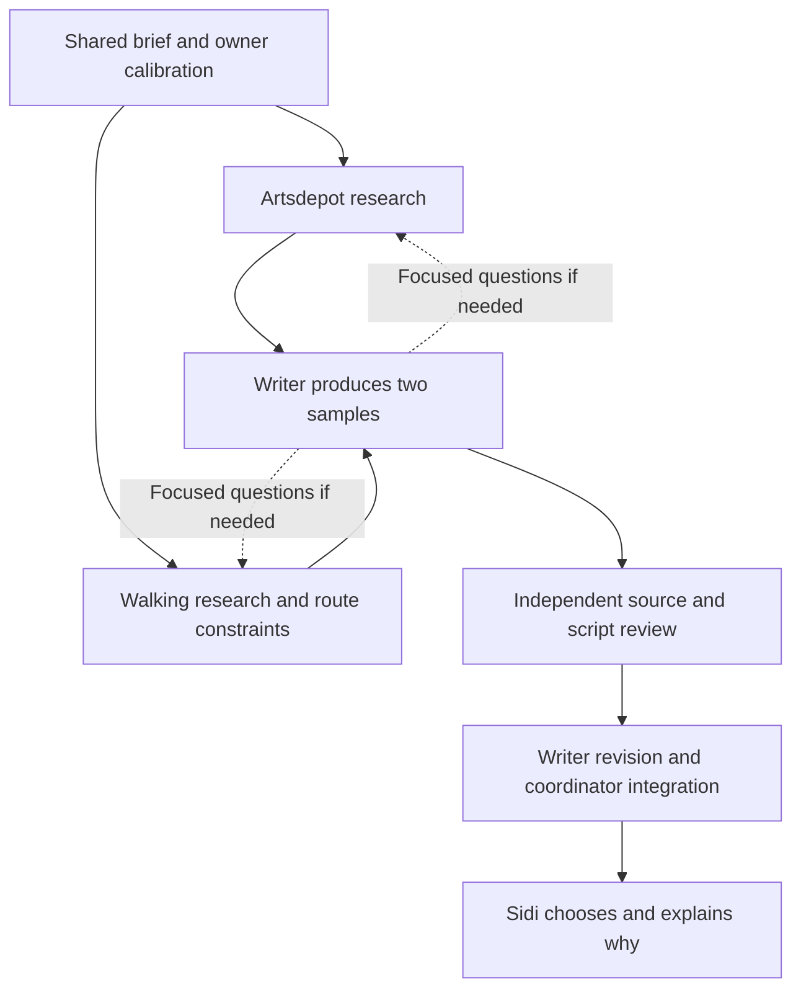

# Tour authoring pilot

19 September 2026. A completed desk exercise in commissioning agents: one stationary story and one walking chapter, ready for the owner's editorial reaction. **Start with the [two samples and choices](REVIEW-PACKET.md).** Read the [brief](BRIEF.md) for scope and the [run log](RUN-LOG.md) for actual launches and handoffs. The owner approved the exercise after discussing how prompts, evidence and coordination fit together.

## How the work moves

The two researchers can work independently. Writing needs both their outputs; reviewing needs the actual drafts. The coordinator handles execution and brings editorial tradeoffs to Sidi. A role is an assignment, not a permanently running employee or a newly trained model.

## What an agent receives

The initial message points to an exact saved assignment. The assignment names the shared brief, relevant role guidance, evidence inputs, output files and completion condition. Reading those files supplies the working context; a short launch message does not mean the agent only sees a few sentences. The local [input inventory](INPUTS.json) records baseline hashes, not a claim about exact token use or every agent's reading history.

| Assignment | Saved task words | Additional material |
| --- | ---: | --- |
| [Artsdepot research](prompts/01-stop-research.md) | 322 | Shared brief, calibration, existing narration, role guidance and sources |
| [Walking research and route review](prompts/02-walking-research-route.md) | 338 | Shared guidance, narration, saved route/window and historical sources |
| [Writer](prompts/03-writer.md) | 357 | Writing brief, calibration and both research handoffs |
| [Independent reviewer](prompts/04-reviewer.md) | 327 | Actual drafts, evidence, route constraints and current writing standard |

Counts include each task heading, exclude the launch message and supporting files, and describe this pilot only. The shared writing brief is about 1,260 words. Applicable project instructions also remain in force. We use a fresh delegated context with explicit inputs to make the commission clear; discoveries and later decisions still need a handoff.

## Evidence and preservation

[BASELINE.json](BASELINE.json) captures four relevant original stories for comparison. It is historical material, not a claim that those sources were reopened by every role. [CALIBRATION.md](CALIBRATION.md) connects the owner's reactions to practical choices. Original packages, raw voice notes and owner Word documents are outside the write scope.

The run log records material discoveries, review findings and revisions. [V1](DRAFT-V1.md), the [independent review](REVIEW.md), [V2](DRAFT-V2.md) and [revision notes](REVISION-NOTES.md) are retained separately. Owner selection remains pending until Sidi has seen the samples; completing the workflow does not prove improved enjoyment or physical suitability.

## What this run taught us

- **Concrete source material changes the available story.** Research found a contemporary account of the arts centre's intended uses and a historical school directory entry. Those supplied explanations and scenes the task message alone could not provide.
- **A replacement needs its surrounding text.** The reviewer caught an optional opening that removed the introduction needed by the following paragraph. The writer repaired that join and recounted the complete alternative.
- **Ready means a named completed version.** Source checks overlapped drafting usefully, but preliminary comments targeted text the writer was still editing. The final review names the frozen V1 hash. Preserve that handoff before evaluating prose, and separate earlier working observations from actual revision findings.
- **Ask for more research when there is a gap.** The writer needed no additional research for these chosen angles. The coordinator stopped further exploration once the packets were adequate; unresolved archive and exact-entry questions remain labelled for relevant future work.

These are observations about this pilot, not a controlled comparison of agent counts. The next learning is Sidi's judgement of the actual passages and alternatives. No permanent extra agent, software framework or new test campaign follows automatically.
